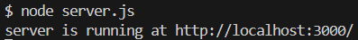
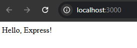

# How to Install and Set Up Express & Creating a Basic Web Server

## Installing Express.js

Before setting up an Express server, you need to install **Node.js** on your system. If you haven't installed it yet, download and install it from [nodejs.org](https://nodejs.org/docs/latest/api/documentation.html).

### Step 1: Initialize a New Node.js Project
To start, create a new folder for your project and navigate to it in your terminal

```sh
mkdir my-express-app
cd my-express-app
```
Next, Initialize a Node.js project by running:
```sh 
npm init -y
```
This will generate a [`package.json`](https://docs.npmjs.com/cli/v11/configuring-npm/package-json) file that manages your project's dependencies.

<br>

### Step 2: Install Express
Now, Install Express by running:
```sh
npm install express
```
This command will download and save Express in your project's dependencies.

<br>
<br>

## Creating a Basic Express Server :earth_americas:
Once Express is installed, you can create a basic web server.

### Step 1: Create a Server File
Inside your project folder, create a new file called `server.js` and open it in your code editor.

<br>

### Step 2: Write Basic Express Code
In `server.js`, add the following code: 

```js 
const express = require("express"); // Import Express
const app = express(); // Create an Express app

// Define a basic route
app.get("/", (req, res) => {
    res.send("Hello, Express!");
});

// Start the server on port 3000
app.listen(3000, () => {
    console.log("Server is running on http://localhost:3000");
});
```
!!! tip
    Always use `req` and `res` instead of `request` and `response` for cleaner and more standard code.
    ```js
    app.get("/", (req, res) => {
        res.send("hello world");
    });
    ```

<br>

### Step 3: Run the Server
Save the file and run the following command in your terminal:

```sh
node server.js
```
!!! success
    If everything is set up correctly, you should see the message on console:
    ```sh
    Server is running on http://localhost:3000
    ```
Now open your browser and go to **http://localhost:3000**. You should see the text **"Hello, Express!"** displayed on the page. :tada:
!!! example
    { width="800" }

<br>

!!! success 
    If you've followed all the steps correctly, you should see **"Hello, Express!"** in your browser.

This page covers the essential first steps to setting up an Express app.
!!! example
    { width="800" }