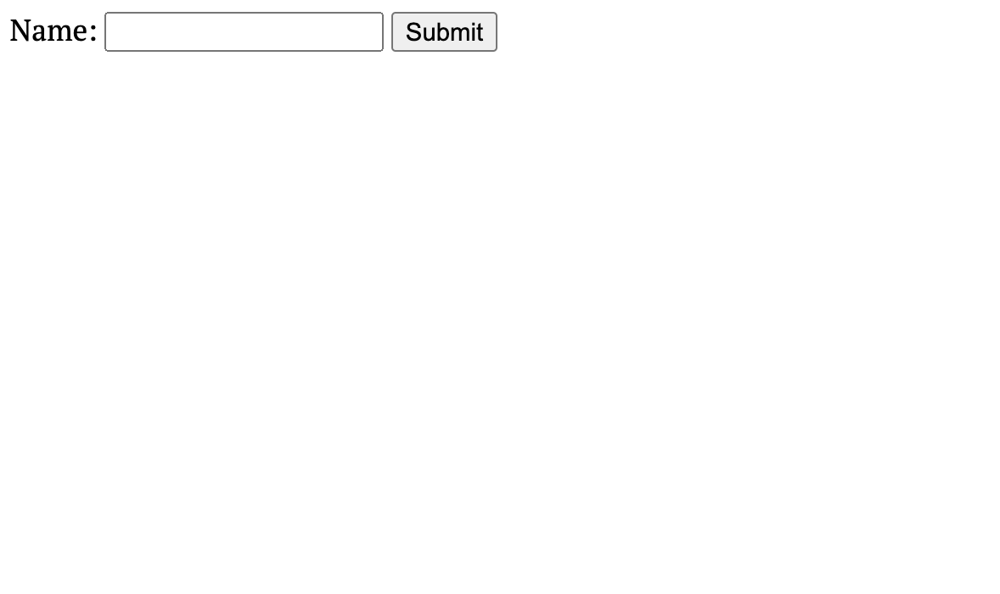

# Handling simple routes (*GET*, *POST*)

## Welcome to routing in [Express][express] :link:

[Routes](https://expressjs.com/en/guide/routing.html) in Express define the endpoints of your web application. Each route specifies an HTTP method (GET, POST, etc.) that the server responds to. When a request is made to a route, Express executes the associated function to handle the request and send a response. 
!!! example

    You do not have to understand the topic in depth to follow the tutorial, but simply this is how it works:
    > Request and response are the GET/POST methods that we will be assigning. Server is your computer & your code and browser is your browser.

    <figure markdown="span">
    { width="900" }
    { width="900" }
    <figcaption>Taken from GOV.UK Prototype Kit: [source](https://prototype-kit.service.gov.uk/docs/create-routes)
    </figcaption>
    </figure>


## Difference between GET and POST


#### GET
**GET** requests are used to retrieve data from the server. Multiple identical requests should have the same effect as a single request.
> For example, if you request go to this website from your phone and from your laptop, you will get the same information on the same page and url.

#### POST
**POST** requests are used to send data to the server to create or update a resource. Multiple identical requests can have *different* effects.
> For example if you login into your account, and someone else logs into theirs, you both will not get the same profile shown.


## Lets start routing
!!! tip
 
    Usually its a good idea to handle routes in separate files, depending on the start of the route: 
    #### server.js
    ``` js
    app.use('/', indexRoute)
    ```
    #### indexRoute.js
    ``` js
    router.get('/', (req, res) => {
    res.send('Hello, world!');
    });
    ```
    **But for the sake of simplicity we are going to handle the routes in the same server.js file.**

#### Get request
Lets start by creating a GET request to get a simple form to display. Replace your basic route that sends hello world with this code:
    ``` js
    app.get('/', (req, res) => {
    res.send(`
    <form action="/submit" method="POST">
      <label for="name">Name:</label>
      <input type="text" id="name" name="name">
      <button type="submit">Submit</button>
    </form>
    `);
    });
    ```
> Notice how we used ```app.get```?  This is how you tell express whether you want to use GET method or POST.

Now run it (```node server.js```) and go to localhost!

!!! danger

    If you have not stopped hosting the 
    ```server.js``` file, it will not auto-update.
    To update stop hosting using control+c
    #### Windows
    >Ctrl c
    #### Mac
    >^c

    After that run node command again. (```node server.js```)

!!! success

    If you have done everything successfully, you should see the following:

    { width="800" }

#### Post request

Now, start by adding another route as well as *middleware* which we need for post to work. Lets add the middleware before our get route and a post route right after our get request. Add the following:

``` js
    // Middleware to parse the body of POST requests
    app.use(express.urlencoded({ extended: true }));


    // YOUR PREVIOUS CODE **********
    app.get('/', (req, res) => {
    res.send(`
    <form action="/submit" method="POST">
      <label for="name">Name:</label>
      <input type="text" id="name" name="name">
      <button type="submit">Submit</button>
    </form>
    `);
    });
    // *****************************


    // Define a POST route to handle form submission
    app.post('/submit', (req, res) => {
    const name = req.body.name;
    res.send(`Hello, ${name}!`);
});

```

If you did everything right, you should see something like this:

!!! success

    Of course instead of "John Doe", it will be your name.

    { width="800" }

Thats it, as easy as that!

!!! tip

    Idealy, you do not want to use res.send in a post request. 
    Because if you go back, refresh and try going to */submit* again, you will get an error.

    > This is because you are not sending a post request, but rather trying to **GET** /submit route. Using res.redirect with another get route would make youre post request stay there
    
    Example: Instead of your **POST** request, use:
    ``` js
    // Define a POST route to handle form submission
    app.post('/submit', (req, res) => {
    const name = req.body.name;
    res.redirect(`/success?name=${name}`);
    });

    // Define a GET route to display the success message
    app.get('/success', (req, res) => {
    const name = req.query.name;
    res.send(`Success! Hello, ${name}!`);
    });
    ```


<!-- Links *********************************************-->
[express]: https://expressjs.com
<!--*****************************************************-->