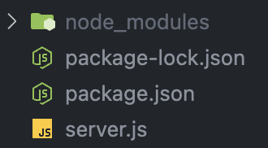
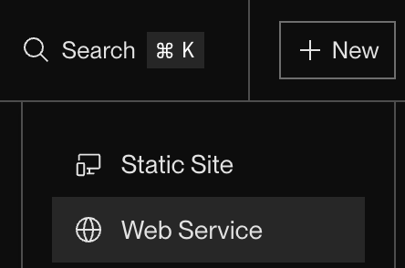
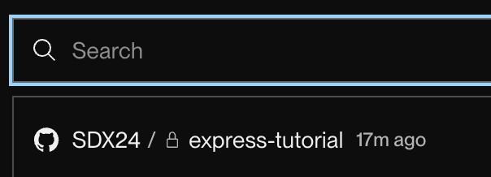
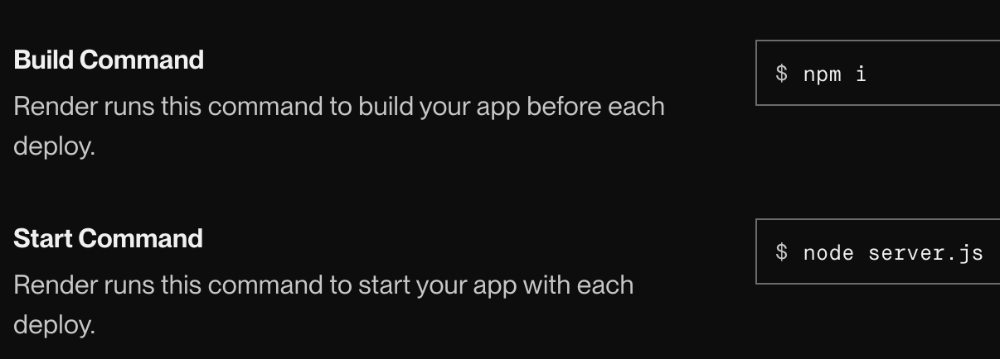
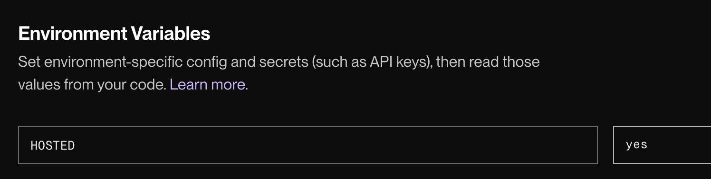
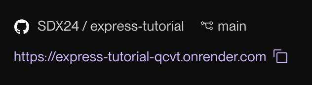

# Hosting your app

## Why is this important 💫
Before you go forward and explore Express on your own, it is important to know one last thing: how to [host](https://www.hostinger.com/tutorials/what-is-web-hosting) your app.

> Hosting is basically making your app run independant of your computer (on a separate, *dedicated* server)

## Services  :wheel:
### To host your app:

1. You can use a **paid** service, here are some examples:
    - [Heroku](www.heroku.com/)
    - [AWS](aws.amazon.com/) (Amazon Web Services)
    - [DigitalOcean](www.digitalocean.com/)

2. You can use some **free** services, like:
    - [Render](render)
    - [Vercel](https://vercel.com)
    - [GitHub Pages](https://pages.github.com) (for *static* sites)

We are going to use [Render](render) for this tutorial.

### Step 1: Create an account on Render
Go to [Render](render) and sign up for a free account.

### Step 2: Create a new file
Create a new file if you are starting from scratch, or replace your "*server.js*" in your project directory with the following content:
``` js

    const express = require("express");
    const app = express();
    require('dotenv').config();

    app.get('/', (req, res) => {
    if (process.env.HOSTED === 'yes') {
        res.send('Your app is hosted!');
    } else {
        res.send('Your app is running locally.');
    }
    });

    app.listen(3000, () => {
    console.log("Server is running on http://localhost:3000");
    });

```
#### .env
As you can see, we will be using a Node.Js package called [dotenv](https://www.npmjs.com/package/dotenv). You will need to install it:

``` js
npm install dotenv
```
> Run this command in your *terminal*

Now, in the same directory you need to create a file called `.env`
Put this inside of it
``` js
HOSTED=no
```

### Step 3: Upload to [Github](git)

At this point, your working folder should look something like this:

!!! example

    Your **.js** file might have a different name, but should be similar

    <figure markdown="span">
    { width="600" }
    </figure>

Add a `.gitignore` file to the same folder put `node_modules` inside of it. This will prevent hundreds of modules you installed from going into your *[git](git) repository*

Now, create a new repository (it can be private or public, but preferably private).
If you are not sure how to do this, check [this guide](https://docs.github.com/en/repositories/working-with-files/managing-files/adding-a-file-to-a-repository) out!

### Step 4: Upload to [Render](render)
* Last step needed. Go on render and select "create new web service"
    <figure markdown="span">
    { width="600" }
    </figure>

* From the dropdown, select your git repository
    <figure markdown="span">
    { width="600" }
    </figure>

* Update build and start commands to use `npm` and `node *server.js*`
    <figure markdown="span">
    { width="600" }
    </figure>

* Select instance type **Free** :dollar:


* In Environment Variables section, type `HOSTED` and a value `yes`
    <figure markdown="span">
    { width="600" }
    </figure>

!!! danger

    HOSTED should be capitalised as that is what we have put in dotenv. dotenv is **case sensitive**

* Click deploy

* Open your render website
    <figure markdown="span">
    { width="600" }
    </figure>

### If you were successful, you should see this:
!!! success

    <figure markdown="span">
    { width="600" }
    </figure>

    Successful deployment

# Congratulations on setting up your first Express.js App! :stars: :stars: :stars:

<!-- Links *********************************************-->
[render]: https://render.com
[git]: github.com
<!--*****************************************************-->
